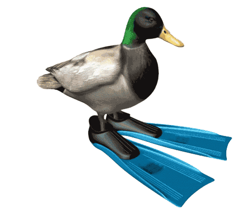

<head>
    <title>GDPLAYER</title>

    <link href="styles.css" type="text/css" rel="stylesheet">
    <link rel="icon" href="icon.png">
</head>

<body>
    

		
	

    

		
	

    
  

		
	

  

    

            
      <textarea class="mAdjust logoMode" id="input" placeholder="Level Name"></textarea>
  

  

            
    <textarea class="mAdjust logoMode" id="input" placeholder="Discription (optional)"></textarea>

  

    

      ⠀⠀⠀⠀
      
      ⠀⠀⠀⠀
        

    

  

  

		
		
		
		
	

  
</body>
